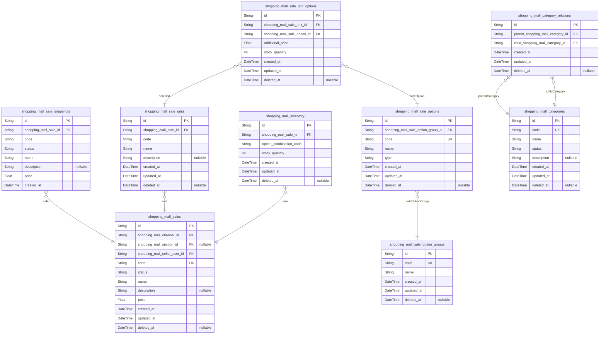

# Prisma Markdown

> Generated by [`prisma-markdown`](https://github.com/samchon/prisma-markdown)

- [Systematic](#systematic)
- [Actors](#actors)
- [Sales](#sales)
- [Carts](#carts)
- [Orders](#orders)
- [Coupons](#coupons)
- [Inquiries](#inquiries)
- [Favorites](#favorites)
- [BusinessRules](#businessrules)
- [AdvancedFeatures](#advancedfeatures)

## Systematic

### `shopping_mall_channels`

Represents sales channels through which products are sold, such as
websites, mobile apps, or physical kiosks. Channels organize sales under
distinct business contexts and are configured separately to enable
multi-channel commerce.

Properties as follows:

- `id`: Primary Key.
- `code`: Unique code identifying the channel. Used in URL paths and API endpoints.
- `name`: Human-readable name of the sales channel.
- `description`: Detailed description of the channel's purpose and characteristics.
- `status`: Status of the channel, e.g., active, inactive, pending.
- `created_at`: Timestamp when the channel was created.
- `updated_at`: Timestamp when the channel was last updated.
- `deleted_at`: Timestamp when the channel was logically deleted (soft delete).

### `shopping_mall_sections`

Defines spatial product groupings similar to store corners, providing a
way to organize products by physical or logical space within channels or
the mall overall.

Properties as follows:

- `id`: Primary Key.
- `code`: Unique code for identifying the section.
- `name`: Display name of the section.
- `description`: Optional detailed description of the section.
- `status`: Current status of the section in the system lifecycle.
- `created_at`: Timestamp when the section was created.
- `updated_at`: Timestamp when the section was last updated.
- `deleted_at`: Timestamp of soft deletion, if applicable.

### `shopping_mall_channel_categories`

Maps hierarchical product categories to specific channels, enabling
channel-customized product classifications and category structures.

Properties as follows:

- `id`: Primary Key.
- `shopping_mall_channel_id`: Belonged sales channel's [shopping_mall_channels.id](#shopping_mall_channels).
- `shopping_mall_category_id`: Belonged product category's [shopping_mall_categories.id](#shopping_mall_categories).
- `created_at`: Timestamp when the channel-category mapping was created.
- `updated_at`: Timestamp when the channel-category mapping was last updated.
- `deleted_at`: Timestamp when the mapping was logically deleted.

### `shopping_mall_attachments`

Storage for all attachment files such as images, documents, or multimedia
related to products, posts, and system resources. Supports metadata
management and secure CDN distribution.

Properties as follows:

- `id`: Primary Key.
- `file_name`: Stored file name including extension.
- `file_url`: Publicly accessible URL pointing to the file location, typically via CDN.
- `media_type`: MIME type of the file, e.g., image/png, application/pdf.
- `file_size`: Size of the file in bytes.
- `upload_ip`: IP address from which the file was uploaded.
- `created_at`: Timestamp when the attachment was uploaded.
- `updated_at`: Timestamp when the attachment metadata was last modified.
- `deleted_at`: Timestamp when the attachment was logically deleted.

## Actors

### `shopping_mall_guestusers`

Guest user connections to the shopping mall, tracking non-member visitor
information per session without authentication credentials. Used for
anonymous browsing and session-based identification.

Properties as follows:

- `id`: Primary Key.
- `ip_address`: IP address of the guest user connection.
- `access_url`: The access URL the guest used to arrive at the mall.
- `referrer`: HTTP referrer URL if available.
- `user_agent`: User-Agent string from the guest browser.
- `session_start_at`: Timestamp when the guest session started.
- `session_end_at`: Timestamp when the guest session ended or expired.
- `created_at`: Record creation timestamp.
- `updated_at`: Last update timestamp.
- `deleted_at`: Timestamp when guest record was logically deleted, if applicable.

### `shopping_mall_memberusers`

Member user information representing registered customers with
authentication credentials, profile data, and account status. Members can
make purchases, manage orders, and participate in reviews.

Properties as follows:

- `id`: Primary Key.
- `email`: Member's unique email address used for login and communication.
- `password_hash`: Hashed password for member authentication.
- `nickname`: Nickname chosen by the member for display.
- `full_name`: Full name of the member for official documentation.
- `phone_number`: Contact phone number of the member.
- `status`
  > Current status or lifecycle state of the member account (e.g., active,
  > suspended, closed).
- `created_at`: Account creation timestamp.
- `updated_at`: Last update timestamp.
- `deleted_at`: Timestamp when member account was logically deleted.

### `shopping_mall_sellerusers`

Seller user information representing members who have permissions to
register products and manage sales. Sellers have extended profile and
status fields reflecting their seller lifecycle state.

Properties as follows:

- `id`: Primary Key.
- `email`: Seller's unique email address used for login and communication.
- `password_hash`: Hashed password for seller authentication.
- `nickname`: Nickname chosen by the seller for public display.
- `full_name`: Full name of the seller for official documentation.
- `phone_number`: Contact phone number of the seller.
- `status`
  > Current lifecycle status of the seller account (e.g., active, pending,
  > suspended).
- `business_registration_number`: Official business registration number for the seller.
- `created_at`: Account creation timestamp.
- `updated_at`: Last update timestamp.
- `deleted_at`: Timestamp when seller account was logically deleted.

### `shopping_mall_adminusers`

System administrator user information with full access and elevated
privileges to manage the shopping mall backend platform. Includes
authentication credentials and status tracking.

Properties as follows:

- `id`: Primary Key.
- `email`: Administrator's unique email address for login.
- `password_hash`: Hashed password for administrator authentication.
- `nickname`: Display nickname for the administrator.
- `full_name`: Full legal name of the administrator.
- `status`: Current administrator account status (e.g., active, suspended).
- `created_at`: Account creation timestamp.
- `updated_at`: Last update timestamp.
- `deleted_at`: Timestamp when administrator account was logically deleted.

## Sales

### `shopping_mall_sales`

Business entity representing products for sale in the shopping mall. This
primary table stores essential product details, status, seller
references, and pricing information. It relates to sales snapshots for
history preservation and connects with categories and inventory
management tables.

Properties as follows:

- `id`: Primary Key.
- `shopping_mall_channel_id`: Belonged channel's {\@link shopping_mall_channels.id}.
- `shopping_mall_section_id`: Belonged section's {\@link shopping_mall_sections.id}.
- `shopping_mall_seller_user_id`: Belonged seller user's [shopping_mall_sellerusers.id](#shopping_mall_sellerusers).
- `code`: Unique product code for business identification.
- `status`
  > Product status indicating lifecycle state such as active, paused, or
  > discontinued.
- `name`: Product name/title.
- `description`: Detailed product description.
- `price`: Base price of the product.
- `created_at`: Creation timestamp.
- `updated_at`: Last update timestamp.
- `deleted_at`: Logical deletion timestamp for soft delete.

### `shopping_mall_sale_snapshots`

Snapshot table preserving historical states of shopping mall sales
products for audit and rollback purposes. Each snapshot captures the
entire product state at a point in time.

Properties as follows:

- `id`: Primary Key.
- `shopping_mall_sale_id`: Referenced product's [shopping_mall_sales.id](#shopping_mall_sales).
- `code`: Captured product code at snapshot time.
- `status`: Captured product status at snapshot time.
- `name`: Captured product name/title at snapshot time.
- `description`: Captured detailed product description at snapshot time.
- `price`: Captured product base price at snapshot time.
- `created_at`: Creation timestamp of the snapshot record.

### `shopping_mall_sale_units`

Subsidiary entity representing units or components composing sales
products. It supports composition and inventory management at a finer
granularity.

Properties as follows:

- `id`: Primary Key.
- `shopping_mall_sale_id`: Belonged product [shopping_mall_sales.id](#shopping_mall_sales).
- `code`: Unit code used for identification under the product.
- `name`: Unit name/title.
- `description`: Detailed description of the unit.
- `created_at`: Creation timestamp.
- `updated_at`: Last update timestamp.
- `deleted_at`: Logical deletion timestamp.

### `shopping_mall_sale_unit_options`

Subsidiary table representing options applied to specific sale units. It
links unit option selections to sale units for detailed configuration.

Properties as follows:

- `id`: Primary Key.
- `shopping_mall_sale_unit_id`: Belonged sale unit [shopping_mall_sale_units.id](#shopping_mall_sale_units).
- `shopping_mall_sale_option_id`: Applied sale option [shopping_mall_sale_options.id](#shopping_mall_sale_options).
- `additional_price`: Additional price added by this option.
- `stock_quantity`: Inventory stock quantity for this option unit.
- `created_at`: Creation timestamp.
- `updated_at`: Last update timestamp.
- `deleted_at`: Logical deletion timestamp.

### `shopping_mall_sale_options`

Primary entity defining possible sale options applicable across products.
Supports distinct option groups and value selections.

Properties as follows:

- `id`: Primary Key.
- `shopping_mall_sale_option_group_id`: Belonged option group [shopping_mall_sale_option_groups.id](#shopping_mall_sale_option_groups).
- `code`: Unique code identifying the sale option.
- `name`: Descriptive name of the sale option.
- `type`: Type of the option (e.g., selection, boolean).
- `created_at`: Creation timestamp.
- `updated_at`: Last update timestamp.
- `deleted_at`: Logical deletion timestamp.

### `shopping_mall_sale_option_groups`

Primary entity representing groups of sale options, enabling modular
configuration of product option sets.

Properties as follows:

- `id`: Primary Key.
- `code`: Unique code for the option group.
- `name`: Name of the option group.
- `created_at`: Creation timestamp.
- `updated_at`: Last update timestamp.
- `deleted_at`: Logical deletion timestamp.

### `shopping_mall_inventory`

Primary entity managing inventory counts for product option combinations.
Links sales products and option selections with stock data.

Properties as follows:

- `id`: Primary Key.
- `shopping_mall_sale_id`: Associated product [shopping_mall_sales.id](#shopping_mall_sales).
- `option_combination_code`
  > Code representing the combination of options this inventory record
  > applies to.
- `stock_quantity`: Available stock quantity for this option combination.
- `created_at`: Inventory record creation time.
- `updated_at`: Last update timestamp of the inventory record.
- `deleted_at`: Logical deletion timestamp for soft delete.

### `shopping_mall_categories`

Primary business entity representing product categories within the
shopping mall. Supports hierarchical categorization and active status
management.

Properties as follows:

- `id`: Primary Key.
- `code`: Unique category code.
- `name`: Category name.
- `status`: Category status such as active or inactive.
- `description`: Optional category description.
- `created_at`: Creation timestamp.
- `updated_at`: Last update timestamp.
- `deleted_at`: Logical deletion timestamp.

### `shopping_mall_category_relations`

Subsidiary junction table representing relationships among product
categories forming a hierarchy or multiple parent-child links.

Properties as follows:

- `id`: Primary Key.
- `parent_shopping_mall_category_id`: Parent category [shopping_mall_categories.id](#shopping_mall_categories).
- `child_shopping_mall_category_id`: Child category [shopping_mall_categories.id](#shopping_mall_categories).
- `created_at`: Relation establishment timestamp.
- `updated_at`: Last update timestamp.
- `deleted_at`: Logical deletion timestamp.

## Carts

### `shopping_mall_carts`

Stores shopping cart sessions for customers, linked optionally to guest
or member users. Supports cart lifecycle tracking via status, timestamps,
and soft deletion.

Properties as follows:

- `id`: Primary Key.
- `guest_user_id`: Belonged guest customer's shopping_mall_guestusers.id.
- `member_user_id`: Belonged member customer's shopping_mall_memberusers.id.
- `created_at`: Cart creation timestamp.
- `updated_at`: Cart last update timestamp.
- `deleted_at`: Soft deletion timestamp.
- `status`: Current cart status, e.g. active, abandoned, expired.

### `shopping_mall_cart_items`

Items that belong to a shopping cart, linked to product snapshots. Tracks
quantity, pricing, status, timestamps, and soft deletion. Subsidiary to
shopping_mall_carts.

Properties as follows:

- `id`: Primary Key.
- `shopping_cart_id`: Belonged shopping cart's shopping_mall_carts.id.
- `shopping_sale_snapshot_id`: Referenced product snapshot shopping_mall_sale_snapshots.id.
- `quantity`: Quantity of the product in the cart item.
- `unit_price`: Unit price of the product at the time of addition to cart.
- `created_at`: Cart item creation timestamp.
- `updated_at`: Cart item last update timestamp.
- `deleted_at`: Soft deletion timestamp if item removed from cart.
- `status`: Status of the cart item, e.g. pending, ordered, cancelled.

### `shopping_mall_cart_item_options`

Selected product option details for each cart item unit, linking option
groups and options to enable precise cart item configuration. Subsidiary
to cart items.

Properties as follows:

- `id`: Primary Key.
- `shopping_cart_item_id`: Belonged shopping cart item shopping_mall_cart_items.id.
- `shopping_sale_option_group_id`: Referenced option group shopping_mall_sale_option_groups.id.
- `shopping_sale_option_id`: Referenced option shopping_mall_sale_options.id.
- `created_at`: Option selection creation timestamp.
- `updated_at`: Option selection last update timestamp.

## Orders

### `shopping_mall_orders`

Represents customer orders within the shopping mall system, capturing
order details and lifecycle. Each order is linked to a member user who
placed it and to the channel and section through which it was made. The
model tracks order status, payment status, total price, and timestamps.
Supports soft deletion and audit trails via timestamps.

Properties as follows:

- `id`: Primary Key.
- `shopping_mall_memberuser_id`
  > Belonged member user who placed the order. {@link
  > shopping_mall_memberusers.id}.
- `shopping_mall_channel_id`
  > Sales channel through which the order was placed. {@link
  > shopping_mall_channels.id}.
- `shopping_mall_section_id`
  > Section representing spatial grouping of the order. {@link
  > shopping_mall_sections.id}.
- `order_code`: Unique business identifier for the order.
- `order_status`
  > Current status of the order such as 'pending', 'confirmed', 'shipped',
  > 'delivered', 'cancelled'.
- `payment_status`: Current status of payment such as 'pending', 'paid', 'cancelled'.
- `total_price`: Total price of the order including all items and discounts.
- `created_at`: Timestamp for when the order was created.
- `updated_at`: Timestamp for when the order was last updated.
- `deleted_at`: Timestamp for soft deletion; null if not deleted.

### `shopping_mall_order_items`

Order items belonging to a specific shopping mall order. Each item
references the product sale snapshot for consistency and tracks quantity,
price, and status. This supporting entity enables detailed management of
individual order contents, including returns and exchanges.

Properties as follows:

- `id`: Primary Key.
- `shopping_mall_order_id`: Belonged order for this item. [shopping_mall_orders.id](#shopping_mall_orders).
- `shopping_mall_sale_snapshot_id`
  > Referenced sale snapshot for the product in this order item. {@link
  > shopping_mall_sale_snapshots.id}.
- `quantity`: Quantity ordered of this product item.
- `price`: Price per unit of the product item at order time.
- `order_item_status`
  > Current status of this order item such as 'pending', 'shipped',
  > 'returned'.
- `created_at`: Timestamp when this order item was created.
- `updated_at`: Timestamp when this order item was last updated.

### `shopping_mall_payments`

Payments applied for orders within the shopping mall system. This entity
tracks payment status, associated order, payment method, amount,
transaction details, and timestamps. Supports payment cancellation and
asynchronous confirmation.

Properties as follows:

- `id`: Primary Key.
- `shopping_mall_order_id`: Order to which this payment applies. [shopping_mall_orders.id](#shopping_mall_orders).
- `payment_method`
  > Method of payment such as 'credit_card', 'bank_transfer',
  > 'virtual_account'.
- `payment_status`: Status of payment including 'pending', 'confirmed', 'cancelled', 'failed'.
- `payment_amount`: Amount paid in this payment application.
- `transaction_id`: External transaction reference identifier.
- `created_at`: Timestamp when payment was created.
- `updated_at`: Timestamp when payment was last updated.
- `cancelled_at`: Timestamp when the payment was cancelled; null if not cancelled.

### `shopping_mall_deliveries`

Delivery tracking information for orders including shipment statuses,
delivery stages, expected dates, and timestamps. Supports partial and
multi-stage shipments.

Properties as follows:

- `id`: Primary Key.
- `shopping_mall_order_id`: Order to which this delivery belongs. [shopping_mall_orders.id](#shopping_mall_orders).
- `delivery_status`
  > Current status of delivery such as 'preparing', 'shipping', 'delivered',
  > 'exception'.
- `delivery_stage`
  > Stage of delivery process including 'preparation', 'manufacturing',
  > 'shipping', 'completed'.
- `expected_delivery_date`: Expected date/time for delivery completion.
- `start_time`: Timestamp when this delivery stage started.
- `end_time`: Timestamp when this delivery stage ended.
- `created_at`: Timestamp when this delivery record was created.
- `updated_at`: Timestamp when this delivery record was last updated.

## Coupons

### `shopping_mall_coupons`

Business coupons issued in the shopping mall system for discounts and
promotions. These represent master records defining coupon properties,
issuance conditions, usage limits, validity periods, and channel
restrictions. Coupons are managed independently and drive promotional
campaigns across multiple channels and products.

Properties as follows:

- `id`: Primary Key.
- `shopping_mall_channel_id`: Belonged channel's [shopping_mall_channels.id](#shopping_mall_channels).
- `coupon_code`: Unique code identifier for the coupon.
- `coupon_name`: Name of the coupon for display purposes.
- `coupon_description`: Detailed descriptive information about the coupon's purpose.
- `discount_type`: Type of discount (amount, percentage).
- `discount_value`: Value of the discount either as amount or percentage.
- `max_discount_amount`: Maximum discount amount allowed for this coupon.
- `min_order_amount`: Minimum order amount required to apply this coupon.
- `usage_limit`: Maximum number of times this coupon can be used across all customers.
- `per_customer_limit`: Maximum number of times this coupon can be used by one customer.
- `start_date`: Start date and time of coupon validity period.
- `end_date`: End date and time of coupon validity period.
- `status`: Status of the coupon, e.g. active, paused, expired.
- `created_at`: Record creation timestamp.
- `updated_at`: Record last update timestamp.
- `deleted_at`: Logical deletion timestamp for soft delete.

### `shopping_mall_coupon_conditions`

Conditions specifying the applicability and constraints of coupons. These
subsidiary entries control which products, sections, or categories a
coupon can be applied to, including inclusion or exclusion rules. Managed
through coupon entity lifecycle.

Properties as follows:

- `id`: Primary Key.
- `shopping_mall_coupon_id`: Related coupon's [shopping_mall_coupons.id](#shopping_mall_coupons).
- `condition_type`: Type of condition (include, exclude, etc.).
- `product_id`
  > Target product's [shopping_mall_sales.id](#shopping_mall_sales), nullable if condition
  > relates to other dimension.
- `section_id`
  > Target section's [shopping_mall_sections.id](#shopping_mall_sections), nullable if condition
  > relates to other dimension.
- `category_id`
  > Target category's [shopping_mall_categories.id](#shopping_mall_categories), nullable if
  > condition relates to other dimension.
- `created_at`: Record creation timestamp.
- `updated_at`: Record last update timestamp.

### `shopping_mall_coupon_tickets`

Individual coupon ticket records assigned to customers. These represent
issued coupon instances with their own validity, usage status, and
linkage to customers and coupons. Tickets enable tracking of coupon usage
per customer independent of the global coupon usage.

Properties as follows:

- `id`: Primary Key.
- `shopping_mall_coupon_id`: Associated coupon's [shopping_mall_coupons.id](#shopping_mall_coupons).
- `guestuser_id`
  > Owner guest user's [shopping_mall_guestusers.id](#shopping_mall_guestusers), nullable for
  > member/seller/admin ownership.
- `memberuser_id`
  > Owner member user's [shopping_mall_memberusers.id](#shopping_mall_memberusers), nullable for
  > guest/seller/admin ownership.
- `selleruser_id`
  > Owner seller user's [shopping_mall_sellerusers.id](#shopping_mall_sellerusers), nullable for
  > guest/member/admin ownership.
- `adminuser_id`
  > Owner admin user's [shopping_mall_adminusers.id](#shopping_mall_adminusers), nullable for
  > guest/member/seller ownership.
- `ticket_code`: Unique code for this coupon ticket.
- `valid_from`: Start datetime for the ticket's validity.
- `valid_until`: End datetime for the ticket validity.
- `usage_status`: Current usage status of the ticket (unused, used, expired).
- `used_at`: Datetime when ticket was used, nullable if unused.
- `created_at`: Record creation timestamp.
- `updated_at`: Record last update timestamp.

### `shopping_mall_deposits`

Deposit records representing monetary value held in customer deposit
accounts. Includes metadata about the deposit period, usage, and related
customers (guests or members). These records track deposit lifecycle and
balance management.

Properties as follows:

- `id`: Primary Key.
- `guestuser_id`
  > Linked guest user's [shopping_mall_guestusers.id](#shopping_mall_guestusers), nullable for
  > member owners.
- `memberuser_id`
  > Linked member user's [shopping_mall_memberusers.id](#shopping_mall_memberusers), nullable for
  > guest owners.
- `deposit_amount`: Total deposit amount held in the account.
- `usable_balance`: Current usable balance for transactions.
- `deposit_start_at`: Start datetime of deposit validity period.
- `deposit_end_at`: End datetime of deposit validity period.
- `created_at`: Record creation timestamp.
- `updated_at`: Record last update timestamp.

### `shopping_mall_deposit_charges`

Records of deposit charging applications including payment details,
status, and audit trails. Tracks the lifecycle of deposit charging
operations including approval, cancellation, and failure for guests and
members.

Properties as follows:

- `id`: Primary Key.
- `guestuser_id`
  > Linked guest user's [shopping_mall_guestusers.id](#shopping_mall_guestusers), nullable for
  > member owners.
- `memberuser_id`
  > Linked member user's [shopping_mall_memberusers.id](#shopping_mall_memberusers), nullable for
  > guest owners.
- `charge_amount`: Amount requested for deposit charging.
- `charge_status`: Current status of the charge (pending, approved, cancelled, failed).
- `payment_provider`: Name of the payment provider used.
- `payment_account`: Payment account or reference identifier.
- `paid_at`: Datetime when payment was completed, nullable if unpaid.
- `created_at`: Record creation timestamp.
- `updated_at`: Record last update timestamp.

### `shopping_mall_mileages`

Mileage point records recording earning and usage for customers. Tracks
mileage balances and usage history linked to guests and members.

Properties as follows:

- `id`: Primary Key.
- `guestuser_id`
  > Guest user owner [shopping_mall_guestusers.id](#shopping_mall_guestusers), nullable for member
  > owners.
- `memberuser_id`
  > Member user owner [shopping_mall_memberusers.id](#shopping_mall_memberusers), nullable for
  > guest owners.
- `mileage_balance`: Current mileage point balance.
- `mileage_income`: Total mileage income points.
- `mileage_outcome`: Total mileage used points.
- `mileage_expired`: Mileage points expired and deducted.
- `created_at`: Record creation timestamp.
- `updated_at`: Record last update timestamp.

### `shopping_mall_mileage_donations`

Mileage donations made by administrators to customers as promotional
campaign bonuses or compensation. Records reason, amount, and donation
metadata for audit and reporting.

Properties as follows:

- `id`: Primary Key.
- `adminuser_id`: Admin user donor [shopping_mall_adminusers.id](#shopping_mall_adminusers).
- `memberuser_id`: Member user beneficiary [shopping_mall_memberusers.id](#shopping_mall_memberusers).
- `donation_reason`: Reason for the mileage donation.
- `donation_amount`: Amount of mileage donated.
- `donation_date`: Date and time of the donation.
- `created_at`: Record creation timestamp.
- `updated_at`: Record last update timestamp.

## Inquiries

### `shopping_mall_inquiries`

Customer product inquiries capturing questions and messages related to
products. Supports hierarchical categorization, private posts, and
visibility controls. Linked to members or guests and associated with
channels, sections, and categories for multi-channel management. Tracks
seller responses and inquiry status for workflow management.

Properties as follows:

- `id`: Primary Key.
- `shopping_mall_channel_id`: Associated shopping mall sales channel. [shopping_mall_channels.id](#shopping_mall_channels).
- `shopping_mall_section_id`: Associated mall section within channel. [shopping_mall_sections.id](#shopping_mall_sections).
- `shopping_mall_category_id`: Category classification of inquiry. [shopping_mall_categories.id](#shopping_mall_categories).
- `shopping_mall_memberuserid`
  > Member user who posted the inquiry, if authenticated. {@link
  > shopping_mall_memberusers.id}.
- `shopping_mall_guestuserid`
  > Guest user who posted the inquiry, if unauthenticated. {@link
  > shopping_mall_guestusers.id}.
- `parent_inquiry_id`
  > Parent inquiry for hierarchical threading. {@link
  > shopping_mall_inquiries.id}.
- `inquiry_title`: Title of the inquiry provided by the customer.
- `inquiry_body`: Detailed message or question content of the inquiry.
- `is_private`: Whether the inquiry is private and viewable only by authorized roles.
- `is_answered`: Flag indicating if the inquiry has been answered by a seller or admin.
- `status`: Current status of the inquiry (e.g., 'open', 'closed', 'pending').
- `created_at`: Timestamp when the inquiry was created.
- `updated_at`: Timestamp when the inquiry was last updated.
- `deleted_at`: Soft deletion timestamp, if inquiry is logically deleted.

### `shopping_mall_reviews`

Product reviews submitted by customers, linked to purchase history for
verification. Supports rating, detailed feedback, privacy settings, and
status tracking. Reviews are tied to channels, categories, and members.
Historical modification tracking through created_at and updated_at
timestamps.

Properties as follows:

- `id`: Primary Key.
- `shopping_mall_channel_id`
  > Channel through which the review was submitted. {@link
  > shopping_mall_channels.id}.
- `shopping_mall_category_id`
  > Category classification of the reviewed product. {@link
  > shopping_mall_categories.id}.
- `shopping_mall_memberuserid`
  > Member user who submitted the review. {@link
  > shopping_mall_memberusers.id}.
- `shopping_mall_sale_snapshot_id`
  > Link to product snapshot representing the purchased product. {@link
  > shopping_mall_sale_snapshots.id}.
- `review_title`: Title of the product review.
- `review_body`: Detailed review content provided by the customer.
- `rating`: Numerical rating value given by the customer, usually 1-5.
- `is_private`: Indicates if the review is private and restricted in visibility.
- `status`: Current status of the review (e.g., 'approved', 'pending', 'rejected').
- `created_at`: Timestamp when the review was created.
- `updated_at`: Timestamp when the review was last updated.
- `deleted_at`: Soft deletion timestamp, if review is logically deleted.

### `shopping_mall_comments`

Comments made on inquiries and reviews to support interactive customer
communications. Includes hierarchical reply support, author
identification (members, guests, or sellers), privacy flags, and status
tracking. Comments link to parent posts and support logical deletion with
audit timestamps.

Properties as follows:

- `id`: Primary Key.
- `shopping_mall_inquiry_id`: Referenced inquiry for this comment. [shopping_mall_inquiries.id](#shopping_mall_inquiries).
- `shopping_mall_review_id`: Referenced review for this comment. [shopping_mall_reviews.id](#shopping_mall_reviews).
- `shopping_mall_memberuserid`: Member user who made the comment. [shopping_mall_memberusers.id](#shopping_mall_memberusers).
- `shopping_mall_guestuserid`: Guest user who made the comment. [shopping_mall_guestusers.id](#shopping_mall_guestusers).
- `shopping_mall_selleruserid`
  > Seller user who made the comment if applicable. {@link
  > shopping_mall_sellerusers.id}.
- `parent_comment_id`: Parent comment for nested replies. [shopping_mall_comments.id](#shopping_mall_comments).
- `comment_body`: Content of the comment message.
- `is_private`: Indicates if the comment is private.
- `status`: Current status of the comment (e.g., 'visible', 'hidden', 'deleted').
- `created_at`: Timestamp when the comment was created.
- `updated_at`: Timestamp when the comment was last updated.
- `deleted_at`: Soft delete timestamp for logical deletion of the comment.

### `shopping_mall_seller_responses`

Official seller responses to customer inquiries or reviews. Supports
status tracking, visibility control, and logical deletion. Linked to the
seller user who authored the response and the related inquiry or review.
Enables clear communication between sellers and customers.

Properties as follows:

- `id`: Primary Key.
- `shopping_mall_inquiry_id`
  > Reference to the inquiry this response addresses. {@link
  > shopping_mall_inquiries.id}.
- `shopping_mall_review_id`
  > Reference to the review this response addresses. {@link
  > shopping_mall_reviews.id}.
- `shopping_mall_selleruserid`
  > Seller user who authored the response. {@link
  > shopping_mall_sellerusers.id}.
- `response_body`: Content of the seller's response message.
- `is_private`: Indicates if the response is private and not publicly visible.
- `status`: Current status of the response (e.g., 'published', 'draft', 'deleted').
- `created_at`: Timestamp when the response was created.
- `updated_at`: Timestamp when the response was last updated.
- `deleted_at`: Soft delete timestamp for logical deletion of the response.

## Favorites

### `shopping_mall_favorite_products`

Stores customer's favorite products by referencing the member user and
the product snapshot at the time of favoriting. Supports soft deletion
with logical deletion timestamp and maintains creation/update audit
timestamps. Ensures uniqueness of favorite by member and product
snapshot.

Properties as follows:

- `id`: Primary Key.
- `shopping_mall_memberuser_id`: Belonged customer's [shopping_mall_memberusers.id](#shopping_mall_memberusers).
- `shopping_mall_sale_snapshot_id`
  > Referenced product snapshot at the time of favoriting {@link
  > shopping_mall_sale_snapshots.id}.
- `created_at`: Favorite creation timestamp.
- `updated_at`: Favorite last update timestamp.
- `deleted_at`: Favorite logical deletion timestamp for soft delete.

### `shopping_mall_favorite_inquiries`

Manages customer's favorite inquiries by linking to member users and
inquiry snapshots. Tracks creation, update, and logical deletion times
for proper auditing and personalized data management. Enforces unique
favorite entry per member and inquiry snapshot combination.

Properties as follows:

- `id`: Primary Key.
- `shopping_mall_memberuser_id`: Belonged customer's [shopping_mall_memberusers.id](#shopping_mall_memberusers).
- `shopping_mall_inquiry_snapshot_id`
  > Referenced inquiry snapshot at favoriting time {@link
  > shopping_mall_snapshots.id}.
- `created_at`: Favorite inquiry creation timestamp.
- `updated_at`: Favorite inquiry last update timestamp.
- `deleted_at`: Logical deletion timestamp for soft delete.

### `shopping_mall_favorite_addresses`

Stores customer's favorite shipping addresses by referencing member users
and address snapshots. Maintains timestamps for creation, updates, and
logical deletion for soft delete capability. Enforces uniqueness of
favorite addresses per member and snapshot pair.

Properties as follows:

- `id`: Primary Key.
- `shopping_mall_memberuser_id`: Belonged customer's [shopping_mall_memberusers.id](#shopping_mall_memberusers).
- `shopping_mall_snapshot_id`
  > Referenced address snapshot at the time of favoriting {@link
  > shopping_mall_snapshots.id}.
- `created_at`: Favorite address creation timestamp.
- `updated_at`: Favorite address last update timestamp.
- `deleted_at`: Logical deletion timestamp for soft delete.

## BusinessRules

### `shopping_mall_snapshots`

Stores immutable historical snapshots of various shopping mall entities
to preserve the state at specific points in time for audit, rollback, and
compliance purposes.

Properties as follows:

- `id`: Primary Key.
- `entity_type`
  > Specifies the type of the entity being snapshotted (such as 'order',
  > 'product').
- `entity_id`
  > References the unique identifier of the entity instance the snapshot
  > belongs to.
- `snapshot_data`: JSON string containing the complete snapshot data of the entity state.
- `created_at`: The timestamp when this snapshot was created.

### `shopping_mall_order_audit_logs`

Captures detailed audit trails for order-related events, recording
actions performed by users or system processes for traceability and
accountability.

Properties as follows:

- `id`: Primary Key.
- `shopping_mall_order_id`: Referenced order ID. [shopping_mall_orders.id](#shopping_mall_orders)
- `actor_user_id`
  > UUID of the user who performed the action, if applicable. {@link
  > shopping_mall_memberusers.id}, [shopping_mall_sellerusers.id](#shopping_mall_sellerusers), or
  > [shopping_mall_adminusers.id](#shopping_mall_adminusers)
- `action`: Description of the action performed on the order.
- `action_details`: Additional JSON or text details about the action.
- `performed_at`: Timestamp when the action was performed.

### `shopping_mall_inventory_audit`

Records inventory changes with detailed information about stock
adjustments and actors responsible for the changes to maintain stock
consistency and audit compliance.

Properties as follows:

- `id`: Primary Key.
- `inventory_id`
  > Reference to the inventory item changed. {@link
  > shopping_mall_inventory.id}
- `actor_user_id`
  > User or system actor who caused the inventory change. {@link
  > shopping_mall_memberusers.id}, [shopping_mall_sellerusers.id](#shopping_mall_sellerusers), or
  > [shopping_mall_adminusers.id](#shopping_mall_adminusers)
- `change_type`
  > Type of inventory change such as 'addition', 'subtraction', or
  > 'adjustment'.
- `quantity_changed`: Quantity by which the inventory changed; positive or negative.
- `change_reason`: Optional textual reason for the inventory change.
- `changed_at`: Timestamp when the inventory change was recorded.

### `shopping_mall_coupon_logs`

Logs coupon-related activities, including issuance, redemption, and
expiration events to support compliance and analytics.

Properties as follows:

- `id`: Primary Key.
- `shopping_mall_coupon_ticket_id`
  > Reference to the issued coupon ticket. {@link
  > shopping_mall_coupon_tickets.id}
- `used_by_customer_id`
  > Customer who used the coupon, if applicable. {@link
  > shopping_mall_memberusers.id} or [shopping_mall_guestusers.id](#shopping_mall_guestusers)
- `log_type`: Type of log entry such as 'issuance', 'usage', or 'expiry'.
- `log_data`: Additional log information in JSON or textual format.
- `logged_at`: Timestamp when the log entry was created.

### `shopping_mall_order_status_histories`

Tracks the history of order status changes, including old and new status
with timestamps for monitoring order progress and auditing.

Properties as follows:

- `id`: Primary Key.
- `shopping_mall_order_id`: Reference to the order. [shopping_mall_orders.id](#shopping_mall_orders)
- `old_status`: Order status before transition.
- `new_status`: Order status after transition.
- `changed_at`: Timestamp when the status change occurred.

## AdvancedFeatures

### `shopping_mall_ai_recommendations`

AI-powered personalized product recommendations for shopping mall
customers. Stores recommendation data generated by AI models to enhance
user shopping experience through tailored product suggestions. Each
record includes user context, recommendation type, algorithm details,
recommendation payload, status, and timestamps.

Properties as follows:

- `id`: Primary Key.
- `user_id`: Reference to the member customer receiving the recommendation.
- `recommendation_type`
  > Type/category of recommendation (e.g., 'personal', 'trending',
  > 'category_top').
- `algorithm_version`: Version identifier of the AI algorithm that generated this recommendation.
- `payload`: Serialized JSON payload containing recommended product IDs and metadata.
- `status`: Current status of the recommendation record ('active', 'archived', etc.).
- `created_at`: Record creation timestamp.
- `updated_at`: Last record update timestamp.
- `deleted_at`: Soft deletion timestamp; null if record is active.

### `shopping_mall_fraud_detections`

Tracks suspicious activities detected by AI fraud detection systems
within the shopping mall platform. Enables auditing and investigation of
potential security incidents to enhance platform trust and user safety.
Records include customer and order references, detection types,
confidence levels, resolutions, and timestamps.

Properties as follows:

- `id`: Primary Key.
- `user_id`
  > Reference to the member customer associated with the fraud detection
  > event.
- `order_id`: Related order suspected of fraud, nullable if not order-specific.
- `detection_type`
  > Type/category of fraud detection (e.g., 'payment_fraud',
  > 'account_takeover').
- `confidence_score`: Confidence score of AI detection between 0.0 and 1.0.
- `resolution_status`
  > Resolution status of the fraud case ('pending', 'investigating',
  > 'resolved', 'dismissed').
- `details`: Detailed description or notes about the fraud detection event.
- `detected_at`: Timestamp when the fraud detection occurred.
- `created_at`: Record creation timestamp.
- `updated_at`: Last record update timestamp.
- `deleted_at`: Soft deletion timestamp; null if record is active.

### `shopping_mall_dynamic_pricing`

Dynamic pricing records capturing price adjustments driven by AI
algorithms for products in the shopping mall. Supports business
strategies for price optimization, seasonal discounts, and personalized
pricing. Each record references product identifiers, pricing rules,
adjustment values, algorithm versions, and status with timestamps.

Properties as follows:

- `id`: Primary Key.
- `product_id`: Reference to the product affected by dynamic pricing.
- `pricing_rule_id`: ID of the pricing rule applied for the adjustment.
- `adjusted_price`: The new price after applying the dynamic pricing adjustment.
- `algorithm_version`: Version of the AI algorithm that computed this price adjustment.
- `status`: Current status of the pricing record (e.g. 'active' or 'inactive').
- `effective_from`: Date and time when the dynamic price becomes effective.
- `effective_to`: Date and time after which the price is no longer effective.
- `created_at`: Record creation timestamp.
- `updated_at`: Last record update timestamp.
- `deleted_at`: Soft deletion timestamp if record is deleted logically.

### `shopping_mall_sentiment_analysis`

Stores AI-analyzed customer sentiment data derived from product reviews,
inquiries, and other text inputs within the shopping mall system.
Facilitates sentiment tracking over time per product and aggregated
insights to improve business decisions. Records include references to
product and user, sentiment scores, categories, and timestamps.

Properties as follows:

- `id`: Primary Key.
- `product_id`: Reference to the product analyzed.
- `user_id`
  > Reference to the user who authored the sentiment data; nullable if
  > anonymous.
- `sentiment_score`
  > Sentiment score calculated by AI model, typically ranging from -1
  > (negative) to +1 (positive).
- `sentiment_category`: Category of sentiment such as 'positive', 'neutral', or 'negative'.
- `source_text`: Original text analyzed for sentiment.
- `analysis_date`: Date and time when the sentiment analysis was performed.
- `created_at`: Record creation timestamp.
- `updated_at`: Last record update timestamp.
- `deleted_at`: Soft deletion timestamp; null if record is active.

### `shopping_mall_analytics_dashboards`

Contains configurations and execution logs of analytics dashboards
providing real-time insights for the shopping mall business performance.
Records dashboard types, filter settings, last execution timestamps, and
related metadata to support dashboard refresh and access control.

Properties as follows:

- `id`: Primary Key.
- `dashboard_type`
  > Type/category of the analytics dashboard (e.g., 'sales_overview',
  > 'customer_segmentation').
- `configuration`: Serialized JSON string of dashboard filter and setting configurations.
- `last_run_at`: Timestamp when the dashboard was last executed or refreshed.
- `status`
  > Current operational status of the dashboard (e.g., 'active', 'inactive',
  > 'error').
- `created_at`: Record creation timestamp.
- `updated_at`: Last record update timestamp.
- `deleted_at`: Soft deletion timestamp if the record is logically deleted.
