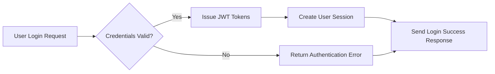
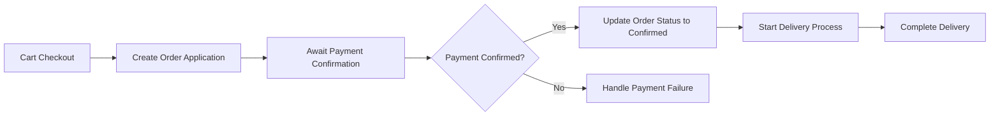
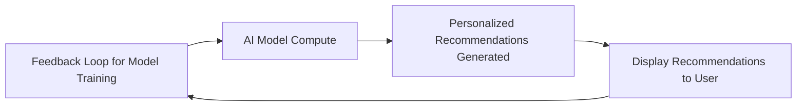

# Shopping Mall AI-Based Backend Requirement Analysis Report

## 1. System Overview

### 1.1 Business Model

The AI-based shopping mall backend system is designed to create a robust, scalable, and secure e-commerce platform. It addresses the gap in existing solutions by providing multi-channel sales support, advanced product categorization, personalized customer engagement through AI-driven recommendations, dynamic pricing, and fraud detection. It targets a competitive online marketplace where differentiation via intelligent backend processing is essential.

Revenue is generated through transaction commissions, premium subscription services for sellers, targeted promotions, and payment processing fees. User acquisition strategies include seamless onboarding, omnichannel experiences, and personalized engagement driven by AI.

Key features include secure user roles and authentication, flexible product and inventory management, comprehensive cart and order processing, dynamic discounts and rewards, real-time inquiry and review management, favorites system with snapshot preservation, multi-channel scalability, and compliance with global regulations.

Success is measured by metrics such as monthly active users, transaction volumes, average order value, customer retention, and operational uptime.

### 1.2 Core Concepts

- **Channel**: Distinct platforms or interfaces through which sales occur.
- **Section**: Logical grouping of products, akin to store corners.
- **Category**: Multi-level classification of products, configurable per channel.
- **Snapshot**: Immutable data capture preserving historical state for audit and compliance.

## 2. User Roles and Authentication

### 2.1 User Roles

| Role       | Description                                                                                   |
|------------|-----------------------------------------------------------------------------------------------|
| guestUser  | Browses publicly accessible resources, can register or login, limited personalized features.  |
| memberUser | Authenticated customers with full purchase and account privileges.                             |
| sellerUser | Member with permissions to manage products and sales analytics.                               |
| adminUser  | System administrator with comprehensive management privileges.                                |

### 2.2 Authentication Flow

WHEN a user attempts login, THE system SHALL validate credentials or external tokens and issue JWT tokens with role and permissions claims.

Access tokens SHALL expire after 30 minutes, refresh tokens after 14 days. THE system SHALL allow token renewal.

### 2.3 Permission Matrix

| Action                  | guestUser | memberUser | sellerUser | adminUser |
|--------------------------|-----------|------------|------------|-----------|
| Browse catalog           | ✅         | ✅          | ✅          | ✅         |
| Add to cart             | ❌         | ✅          | ✅          | ✅         |
| Manage orders           | ❌         | ✅          | ✅          | ✅         |
| Post inquiries/reviews  | ❌         | ✅          | ✅          | ✅         |
| Manage products         | ❌         | ❌          | ✅          | ✅         |
| Configure system        | ❌         | ❌          | ❌          | ✅         |

## 3. Product Management

### 3.1 Product Lifecycle

WHEN a seller registers or modifies a product, THE system SHALL create snapshots to preserve previous states.

Products SHALL support status transitions: Draft, Active, Paused, Discontinued.

### 3.2 Options and Inventory

Product options SHALL affect pricing and inventory, tracked at option combination level.

OUT-OF-STOCK options SHALL be flagged automatically.

### 3.3 Categories and Sections

Hierarchical category trees SHALL be configurable per channel. Products MAY belong to multiple categories.

Sections SHALL group products spatially within channels.

### 3.4 Bulletin Board

Product-related posts, inquiries, and reviews SHALL have snapshot edit histories, support comments, replies, attachments, and moderation.

## 4. Cart and Order System

### 4.1 Cart Management

THE system SHALL create or retrieve carts per customer session, distinguishing guest temporary carts and persistent member carts.

Sellers and admins MAY configure cart templates.

### 4.2 Order Processing

WHEN a cart is submitted for checkout, THE system SHALL validate and create an order application.

Payment confirmation SHALL be asynchronous, supporting multiple methods including cash, deposit, mileage.

Partial fulfillment and split orders SHALL be supported.

### 4.3 Delivery and Shipment

Delivery processes SHALL be tracked through preparation, manufacturing, shipping, and delivery with start/completion timestamps and notifications.

Exceptions and partial shipments SHALL be managed.

## 5. Discount and Reward Systems

### 5.1 Coupon Management

Coupons SHALL be issued with configurable discounts, validity, usage limits, exclusivity, and tracked per customer.

### 5.2 Deposit and Mileage

Deposits SHALL be charged and managed with transaction validation, cancellation, and promotions.

Mileage points SHALL accrue and expire per policies; administrators MAY donate mileage.

## 6. Customer Interaction

Product inquiries and reviews SHALL be managed with private posting, verified purchases, moderation, seller responses, and comment notifications.

## 7. Favorites System

Customers SHALL favorite products, inquiries, and addresses with snapshot preservation, organized into categories, and notified of changes like price drops.

## 8. System Architecture and Scalability

Multi-channel support SHALL include independent categories and sections per channel with consistent user experience.

Attachment management SHALL include secure storage, versioning, validation, and CDN delivery.

Data structures SHALL be extensible and denormalized to optimize performance.

## 9. Business Rules and Constraints

Snapshot-based data preservation SHALL ensure audit trails and legal compliance.

Order-payment processes SHALL separate application and payment confirmation with clear state transitions.

Inventory SHALL be managed atomically by option combinations with stock alerts.

Security policies SHALL encrypt sensitive information and enforce role-based access control.

Coupon stacking and refund policies SHALL conform to strict business rules.

## 10. Compliance and Legal

THE system SHALL comply with GDPR, PCI DSS, AML, KYC, e-commerce, and accessibility regulations.

Support for multilingual, multicultural usage and web accessibility standards is mandatory.

## 11. Advanced AI Features

AI SHALL enable personalized recommendations, fraud detection, dynamic pricing, sentiment analysis, real-time analytics, customer segmentation, conversion funnel optimization, lifetime value prediction, and predictive inventory management.

Omnichannel unified profiles and seamless cross-channel order fulfillment SHALL enhance user experience.

---

### Mermaid Diagram: User Authentication Flow

### Mermaid Diagram: Order and Payment Processing

### Mermaid Diagram: AI Recommendation Process

This document provides business requirements only. All technical implementation decisions belong to developers. Developers have full autonomy over architecture, APIs, and database design. The document describes WHAT the system should do, not HOW to build it.
