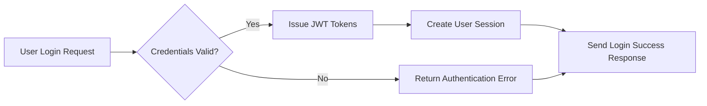
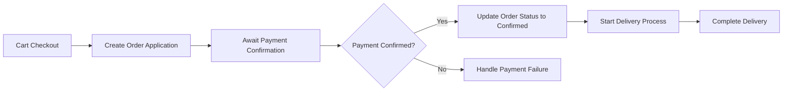
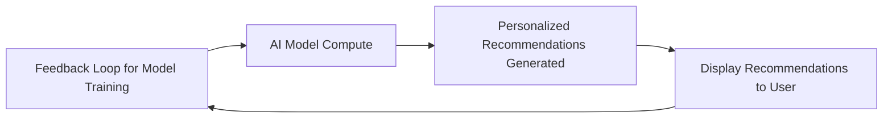

# AI-Based Shopping Mall Backend Requirement Analysis Report

## 1. System Overview

The AI-based shopping mall backend system supports secure multi-channel e-commerce sales with advanced product categorization, order management, robust payment processing, promotional campaigns, customer interaction, and AI-driven personalization.

### 1.1 Business Model

#### Why This Service Exists
The platform fills an underserved market need for intelligent, scalable e-commerce backends capable of personalized shopping experiences, flexible product management, and comprehensive transaction processing.

#### Revenue Strategy
Revenue streams include seller commissions, subscription services, targeted advertising, and payment processing fees.

#### Growth Plan
User acquisition focuses on seamless multi-channel experiences, easy social login integration, and AI-enhanced personalization to increase retention and engagement.

#### Success Metrics
Key metrics include active user counts, transaction volumes, average order values, seller growth, fraud incident reduction, and uptime reliability.

## 2. User Management

### 2.1 Customer Access Modes
- Users can access as members, non-members, or via external services.
- Each connection logs detailed metadata (IP, referrer, access URL).
- The system supports identity verification via mobile number and real name.
- Membership offers registration, multiple emails per account, password security, and account lifecycle management.
- External authentication providers are supported with secure integration.
- Address management supports structured international formats and special instructions.

### 2.2 Seller and Administrator Management
- Regular members may elevate to sellers or administrators.
- Sellers have product registration, sales, inventory, and sales analytics permissions.
- Administrators manage the entire system with role-based access control and audit logging.

## 3. Product Management

### 3.1 Product Lifecycle
- Sellers register, modify, pause, or discontinue products.
- Snapshots are automatically created for all product changes.
- Product lifecycle states are clearly managed.

### 3.2 Options and Inventory
- Complex option types control inventory and pricing.
- Inventory is tracked per option combination with alerts and automatic stock influence.

### 3.3 Category and Section Management
- Categories are hierarchical and channel-specific.
- Products may be assigned to multiple categories.

### 3.4 Product Content and Search
- Detailed product descriptions support rich media and SEO.
- Tag management enhances search relevance and highlights popular products.

### 3.5 Bulletin Board
- Posts and comments support inquiries, reviews, file attachments, hierarchical replies, and moderation.

## 4. Cart and Order System

### 4.1 Cart Management
- Carts track per-customer selections, supporting guest and member persistence.
- Sellers and administrators can configure cart templates.
- Cart sessions expire after inactivity.

### 4.2 Order Processing
- Cart-to-order conversion includes validation and mixed payment methods.
- Asynchronous payment methods and cancellation handling are supported.

### 4.3 Delivery Management
- Delivery is tracked through predefined stages with time logging.
- Partial shipments and international delivery are supported.
- Exception handling and automated notifications are implemented.

## 5. Discount and Payment System

### 5.1 Coupon Management
- Coupons are issued with configurable discount types and usage rules.
- Tracking includes issuance count, use limitations, and performance analytics.

### 5.2 Deposit and Mileage
- Deposit charging and cancellation flows are defined.
- Mileage accrual, expiration, donation, and reporting are managed securely.

## 6. Inquiry and Review System

- Product inquiries, reviews, seller responses, private posts, and comments are managed with snapshot history and moderation.

## 7. Favorites System

- Customers manage favorites for products, inquiries, and addresses with historical snapshots and personalized organizational tools.

## 8. System Structure and Scalability

- Multi-channel support includes channel-specific categories and section management.
- File attachments are securely stored, versioned, validated, and delivered via CDN.
- Data denormalization and extensibility support scalability.

## 9. Business Rules

- Snapshot records preserve all state changes and logical deletion timing instead of physical removal.
- Order and payment processes are tightly controlled with validation and cancellation records.
- Inventory management reacts real-time to sale and stock levels.
- Security policies require encrypted personal and payment data, access audit logging, and role protections.
- Coupon and order refund policies are strictly enforced.

## 10. Compliance and Legal Requirements

- Compliance with GDPR, CCPA, PCI DSS, AML, KYC, e-commerce, and accessibility regulations.
- Multilingual and cultural adaptations including RTL languages are implemented.

## 11. AI and Advanced Features

- Personalized recommendations, fraud detection, dynamic pricing, and sentiment analysis powered by AI.
- Real-time analytics for sales, customer segmentation, funnel analysis, and inventory forecasting.
- Omnichannel customer profiles and seamless cross-channel order management.

---

### Mermaid Diagram: Authentication Flow

### Mermaid Diagram: Order and Payment Processing

### Mermaid Diagram: AI Recommendation Process

The above document states detailed business requirements for the AI-based shopping mall backend platform. It explicitly defines WHAT the system must do, leaving all HOW and technical decisions including architecture, APIs, and databases completely to the development team. Backend developers can rely on this document for clear, testable, and complete functional expectations without ambiguity.