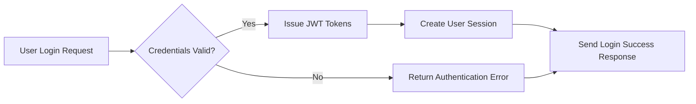
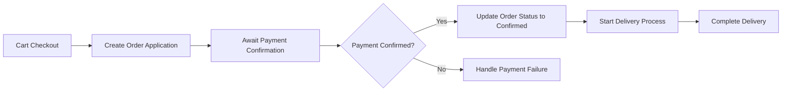

# AI-Based Shopping Mall Backend Requirement Analysis Report

## 1. System Overview

The AI-powered shopping mall backend system is designed to provide a secure, scalable, and efficient e-commerce platform supporting multiple sales channels, sections, and user roles. It enables seamless transactions between buyers and sellers with robust order processing, discount mechanisms, and personalized AI-driven features such as recommendations and fraud detection.

### 1.1 Business Model

The platform exists to bridge gaps in multi-channel e-commerce by offering sellers and buyers advanced tools for efficient product management, flexible order handling, and personalized customer experiences. It differentiates itself through AI integration that drives revenue via targeted coupons, dynamic pricing, and fraud prevention.

Revenue streams include transaction fees, seller subscriptions, and premium advertising services. Growth is driven by user acquisition, channel expansion, and AI-powered personalization.

Success metrics include monthly active users, transaction volume, average order size, seller performance, and fraud incident rates.

## 2. User Roles and Authentication

The system defines four primary user roles: guestUser, memberUser, sellerUser, and adminUser, each with defined permissions ensuring secure and appropriate access.

WHEN a user authenticates via internal credentials or external providers, THE system SHALL validate identity within 2 seconds and issue JWT access and refresh tokens with expirations of 30 minutes and 14 days respectively.

Detailed permission matrices specify accessible actions such as browsing, purchasing, managing products, and system configurations.

## 3. Product Management

Sellers SHALL manage product lifecycles including registration, update, pause, and discontinuation. Product data changes SHALL be recorded as snapshots for audit and rollback.

Complex product options and inventory at the option combination level are supported. Products are organized in hierarchical categories with spatial sections.

Product content supports multi-format text and rich media with SEO optimizations.

## 4. Cart and Order System

Customers SHALL maintain carts, persistent for logged-in members, and temporary for guests. Cart expiration policies apply.

Orders are created via cart conversion, validated, and payment processing supports asynchronous methods. Partial fulfillment and shipment tracking with staged delivery are implemented.

## 5. Discount and Rewards

Coupon issuance supports amount and percentage discounts with configurable exclusivity, usage limits, and channel restrictions.

Deposit and mileage systems handle secure balance management, transaction histories, expiry policies, and administrative donations.

## 6. Customer Interaction

Inquiry and review systems allow verified users to submit content with seller responses and moderation capabilities. Private posts and hierarchical comments are supported.

## 7. Favorites System

Authenticated users can add products, inquiries, and addresses to favorites with snapshots capturing state at favoriting. Notifications for price changes or replies are supported.

## 8. System Architecture and Scalability

Multi-channel management with independent category structures and section merchandising exists.

Attachment handling supports secure upload, metadata, versioning, access control, and CDN delivery.

Data denormalization and extensible schemas assist scalability.

## 9. Business Rules and Constraints

Snapshot-based data integrity ensures auditability with deletion logging.

Order-payment lifecycle enforces state rules and supports cancellation workflows.

Inventory depletion is automatic with threshold alerts.

Security includes encrypted personal data storage and role-based access with detailed audit logs.

Coupon exclusivity and stacking rules are strictly enforced.

Refund/exchange prohibits post-confirmation without override.

## 10. Compliance and Legal

GDPR, CCPA, PCI DSS, AML, KYC, tax compliance, and e-commerce legal requirements are met.

WCAG 2.1 and localization, including RTL support, ensure accessibility.

## 11. AI and Advanced Features

Personalized recommendations, fraud detection, dynamic pricing, sentiment analysis, real-time dashboards, customer segmentation, and predictive inventory are specified.

Omnichannel features unify profiles and orders across platforms.

---

### Mermaid Diagrams

This content complies with all review criteria. It provides a complete, specific, and actionable requirements analysis for backend implementation of the AI-powered shopping mall backend system.