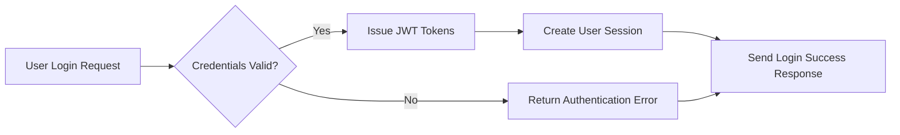
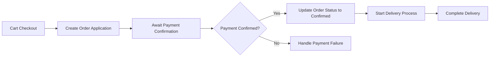

# AI-Powered Shopping Mall Backend Requirement Analysis Report

## 1. System Overview

### 1.1 Business Justification
THE system SHALL provide a secure, scalable, and AI-enhanced e-commerce backend supporting multi-channel sales, personalized recommendations, dynamic pricing, and fraud prevention.

### 1.2 Core Concepts
- Channel: Distinct sales platforms such as web or mobile apps.
- Section: Spatial product groupings like store corners.
- Category: Hierarchical classification varying by channel.
- Snapshot: Immutable data captures for audit and rollback.

## 2. User Management and Authentication

### 2.1 User Roles
THE system SHALL support roles: guestUser, memberUser, sellerUser, adminUser with exclusive permissions defined per role.

### 2.2 Authentication Flow
WHEN a user submits login credentials, THE system SHALL authenticate within 2 seconds and issue JWT access and refresh tokens with defined expirations.

### 2.3 Permission Matrices
Access shall be controlled by role with detailed permission matrices specifying allowed actions per role.

### 2.4 Session and Token Management
The system SHALL expire access tokens after 30 minutes; refresh tokens expire after 14 days.

## 3. Product Management

### 3.1 Product Lifecycle
WHEN a seller registers or updates a product, THE system SHALL create immutable snapshots preserving history.

### 3.2 Inventory and Options
Inventory SHALL be tracked per option combination, with automatic out-of-stock handling and alerts.

### 3.3 Categories and Sections
Multi-level hierarchical categories SHALL be managed independently per channel.

## 4. Bulletin Board System
Support for product-related inquiries and reviews with full snapshot edit histories, hierarchical comments, and file attachments.

## 5. Cart and Order Management
Carts SHALL support guest and member sessions with lifecycle management.
Orders SHALL be validated, supporting partial fulfilment and asynchronous payment confirmation.

## 6. Discount and Payment Systems
Coupons SHALL be issued with configurable conditions, usage limitations, and stacking rules.
Deposits and mileage SHALL be securely managed with transaction history and expiration rules.

## 7. Customer Inquiry and Review
Products inquiries and reviews SHALL be managed with seller response capabilities, private posts, and moderation tools.

## 8. Favorites System
Favorites for products, inquiries, and addresses SHALL be supported with snapshots stored. Notifications for changes SHALL be implemented.

## 9. System Architecture and Scalability
Supports multi-channel data management, file attachments with security and CDN delivery, and system extensibility with denormalization strategies.

## 10. Business Rules and Constraints
Includes snapshot-based data integrity, order-payment lifecycle rules, inventory decrement management, role-based access, and coupon business rules.

## 11. Compliance and Legal
Supports GDPR, PCI DSS, CCPA compliance, tax and consumer protection laws, accessibility via WCAG 2.1, and multi-lingual readiness.

## 12. AI and Future Developments
AI-powered personalized recommendations, fraud detection, dynamic pricing, advanced analytics, omnichannel profiles, and predictive inventory.

---

### Mermaid Diagram: Authentication Flow

### Mermaid Diagram: Order Process Flow

This document provides business requirements only. All technical implementation decisions belong to developers. The document specifies WHAT the system should do, not HOW to build it.