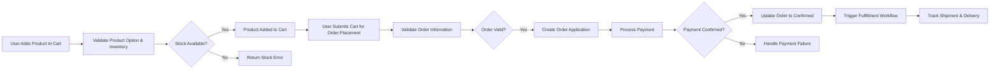

# Shopping Mall Backend: Cart and Order System Requirements Specification

## 1. Introduction

### 1.1 Purpose and Scope
This specification defines the comprehensive business requirements for the cart and order subsystems of the shopping mall backend platform. It enables seamless product selection, order placement, payment processing, and delivery tracking for diverse user roles including guests, members, sellers, and administrators.

### 1.2 System Context
The cart and order systems interface with product management, user management, payment gateways, and logistics modules. The systems support multi-channel storefronts and complex product options.

## 2. User Roles and Permissions

### 2.1 User Roles Definitions
- **guestUser**: Unauthenticated users with permissions to create a temporary cart and browse products but cannot place orders.
- **memberUser**: Registered customers who have persistent carts, can place orders, and manage their order histories.
- **sellerUser**: Members with elevated permissions to access orders relevant to their products and manage sales fulfillment.
- **adminUser**: Administrators with full permissions to manage all carts, orders, payments, and delivery tracking.

### 2.2 Permissions Matrix
| Action                  | guestUser | memberUser | sellerUser | adminUser |
|-------------------------|-----------|------------|------------|-----------|
| Create Cart             | ✅         | ✅          | ❌          | ✅         |
| Modify Cart             | ✅         | ✅          | ❌          | ✅         |
| Delete Cart             | ✅         | ✅          | ❌          | ✅         |
| Convert Cart to Order   | ❌         | ✅          | ❌          | ✅         |
| View Own Orders         | ❌         | ✅          | Limited*   | ✅         |
| Manage Product Orders   | ❌         | ❌          | ✅          | ✅         |
| Manage All Orders       | ❌         | ❌          | ❌          | ✅         |

*SellerUsers can view orders only for their own products.

## 3. Cart System Requirements

### 3.1 Cart Creation and Session Management
- WHEN a guestUser accesses the platform, THE system SHALL create a temporary cart session with a unique identifier.
- WHEN a memberUser logs in, THE system SHALL retrieve or initialize a persistent cart linked to the user account.
- THE system SHALL expire guest carts after 7 days of inactivity automatically.
- THE system SHALL persist member carts between sessions unless emptiness or explicit deletion occurs.
- THE system SHALL support cart session restoration after unexpected logout or session timeout.

### 3.2 Cart Item Management
- WHEN a product is added to a cart, THE system SHALL link the cart item to a product snapshot capturing the exact product state including price and options.
- THE system SHALL store complete option selections and validate these against available product options and inventory.
- THE system SHALL reject attempts to add items with invalid or unavailable option combinations.
- THE system SHALL allow modification, quantity adjustment, and removal of cart items.
- Bulk operations such as batch removal SHALL be supported.

### 3.3 Cart Templates and Configuration
- Sellers and administrators SHALL be able to define cart templates which specify pre-configured option sets and item groupings for customers.
- THE system SHALL apply cart templates during cart creation or modification when requested.

### 3.4 Cart Expiration and Deletion
- Guest carts SHALL expire automatically after 7 days of inactivity with a notification to the user when possible.
- Member carts SHALL be deleted only upon user request or after extended inactivity defined by platform policy (e.g., 180 days).

## 4. Order System Requirements

### 4.1 Order Application and Validation
- WHEN a memberUser submits their cart for order placement, THE system SHALL create an order application record.
- THE system SHALL validate stock, pricing, discount eligibility, payment information, and user identity before finalizing the order.
- Order applications with invalid or insufficient information SHALL be rejected with detailed error messages.

### 4.2 Order Item and Status Management
- THE system SHALL convert cart items into order items maintaining product snapshot references for consistency.
- Order items SHALL support quantity adjustments within validated limits before payment confirmation.
- THE system SHALL track status of each order item independently, supporting partial fulfillment, returns, and exchanges.

### 4.3 Partial Fulfillment and Split Orders
- THE system SHALL support splitting orders into multiple shipments based on seller, product availability, or shipping destinations.
- Partial order fulfillment statuses SHALL be trackable and viewable by customers and sellers.

### 4.4 Order History and Analytics
- Customers SHALL have access to complete order histories.
- Sellers SHALL have analytic reports on orders and sales performance.

## 5. Payment Processing

### 5.1 Payment Application and Lifecycle
- THE system SHALL receive payment applications after order application creation.
- Payment status SHALL be tracked including pending, confirmed, canceled, and failed.
- THE system SHALL support partial payments and multiple payment methods within single orders.

### 5.2 Asynchronous Payment Support
- The system SHALL support payment methods like virtual accounts and bank transfers that require asynchronous confirmation.
- Payment state updates SHALL trigger automatic order status transitions and notifications.

### 5.3 Payment Cancellation and Conflict Resolution
- Payment cancellations before confirmation SHALL be allowed, with clear impact on order status.
- THE system SHALL maintain a history of payment status changes for audit and reconciliation.

### 5.4 Payment Gateway Integration
- THE system SHALL provide integration points for multiple payment gateways supporting various payment types and regions.
- Failures in payment gateway communication SHALL be logged and retried with alerts to administrators.

## 6. Delivery and Shipment Tracking

### 6.1 Delivery Stage Management
- THE system SHALL track delivery through stages: preparation, manufacturing (if applicable), shipping, and delivery.
- Start and completion timestamps SHALL be recorded for each stage.
- THE system SHALL allow custom delivery workflows per seller or product.

### 6.2 Partial Shipment Handling
- THE system SHALL accommodate orders split into multiple shipments tracking each shipment independently.
- Delivery exceptions and delays SHALL be managed with notification workflows.

### 6.3 International Shipping
- THE system SHALL support international shipment rules, address validations, and customs documentation.

### 6.4 Notifications and Exception Handling
- THE system SHALL notify customers and sellers automatically upon delivery stage changes and exceptions.

## 7. Business Rules and Validation

### 7.1 Inventory Validation and Reservation
- THE system SHALL check inventory availability before cart addition and order application.
- Inventory SHALL be reserved upon order confirmation and released upon order cancellation.

### 7.2 Order State Transitions
- Orders SHALL follow defined state transitions from application, payment, fulfillment, to completion.
- State transitions SHALL enforce business rules preventing invalid operations (e.g., refund request only after delivery).

### 7.3 Refund and Cancellation Policies
- Refunds SHALL be disallowed after order confirmation unless explicitly authorized by administrators.
- THE system SHALL track cancellations and related impact on inventory and payments.

### 7.4 Audit Trails
- All critical events in cart, order, and payment lifecycles SHALL be logged for dispute resolution and compliance.

## 8. Error Handling

### 8.1 Stock Shortage
- IF a requested product or option is out of stock, THEN THE system SHALL reject the addition or order with explicit user notification.

### 8.2 Payment Failure
- IF payment fails, THEN THE system SHALL notify customers promptly and provide retry options.

### 8.3 Cart Inconsistencies
- IF invalid or expired product snapshots are detected in cart, THEN THE system SHALL prompt users to refresh cart content.

### 8.4 User Notifications
- THE system SHALL communicate errors and recovery options in clear, understandable language.

## 9. Performance Requirements

- THE system SHALL process cart item additions, validations, and removals within 2 seconds.
- Order application and payment processing SHALL complete within 3 seconds under normal load.
- Notification delivery SHALL be near real-time, within 1 minute of events.
- THE system SHALL support at least 10,000 concurrent cart sessions without degradation.

---

## Order Processing Workflow Diagram

---

This document outlines business requirements only. All technical implementation decisions, including system architecture, APIs, and database design, are at the discretion of the development team. The document specifies WHAT the system must achieve to deliver reliable, robust, and user-focused cart and order management within the AI-enabled shopping mall backend platform.