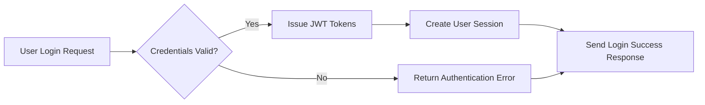
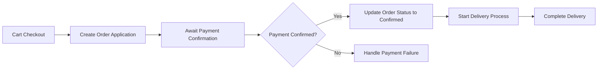

# Shopping Mall AI-Based Backend Requirement Analysis Report

## 1. System Overview

### 1.1 Business Model

#### Why This Service Exists
The AI-based shopping mall backend system is designed to create a robust, scalable, and secure e-commerce platform. It addresses the gap in existing solutions by providing multi-channel sales support, advanced product categorization, personalized customer engagement through AI-driven recommendations, dynamic pricing, and fraud detection. It targets a competitive online marketplace where differentiation via intelligent backend processing is essential.

#### Revenue Strategy
Revenue streams include transaction commissions, subscription or premium services for sellers, targeted promotions via coupons, and payment processing fees. The system enables sellers to maximize sales and merchants to increase customer retention.

#### Growth Plan
The system supports user acquisition by seamless onboarding across channels, supports omnichannel shopping experiences, and incentivizes repeated purchases via loyalty and personalized engagement.

#### Success Metrics
Success will be measured through metrics including monthly active users, number of transactions, average order value, customer satisfaction indices, and seller performance growth.

### 1.2 Core Concepts
- **Channel**: Defines distinct platforms or interfaces through which sales occur.
- **Section**: Spatial grouping of products, akin to physical store corners.
- **Category**: Multi-level classification of products, potentially unique per channel.
- **Snapshot**: Immutable data capture of entities, preserving historical state for audit and legal compliance.

## 2. User Roles and Authentication System

### 2.1 User Roles

| Role       | Description                                                                                   |
|------------|-----------------------------------------------------------------------------------------------|
| guestUser  | Browses publicly accessible resources, can register or login, limited personalized features.  |
| memberUser | Authenticated shoppers with full purchase and account privileges.                             |
| sellerUser | Member with elevated permissions to manage product listings, sales analytics, and inventory. |
| adminUser  | System administrator with comprehensive management and configuration rights.                  |

### 2.2 Authentication Flow

WHEN a user attempts to authenticate, THE system SHALL validate credentials from internal and external providers and issue JWT-based access tokens.

THE system SHALL expire access tokens after 30 minutes and accept refresh tokens valid up to 14 days.

### 2.3 Permission Matrix

| Action                  | guestUser | memberUser | sellerUser | adminUser |
|--------------------------|-----------|------------|------------|-----------|
| Browse catalog           | ✅         | ✅          | ✅          | ✅         |
| Add to cart             | ❌         | ✅          | ✅          | ✅         |
| Manage orders           | ❌         | ✅          | ✅          | ✅         |
| Post inquiries/reviews  | ❌         | ✅          | ✅          | ✅         |
| Manage products         | ❌         | ❌          | ✅          | ✅         |
| Configure system        | ❌         | ❌          | ❌          | ✅         |

## 3. Product Management

### 3.1 Product Lifecycle

WHEN a seller registers a product, THE system SHALL create an immutable snapshot.

THE system SHALL support product status transitions: Draft -> Active -> Paused -> Discontinued.

### 3.2 Options and Inventory

THE system SHALL support product variations with options affecting price and inventory.

Inventory tracking SHALL be precise to option combination level; out-of-stock options SHALL be flagged automatically.

### 3.3 Categories and Sections

THE system SHALL provide hierarchical category trees, customizable per channel, and support section-based grouping.

### 3.4 Bulletin Board

THE system SHALL support product-related posts (inquiries, reviews) with snapshot-based edit history.

Comments and attachments SHALL be supported with moderation capabilities.

## 4. Cart and Order System

### 4.1 Cart Management

THE system SHALL provide per-customer carts supporting guest and member sessions.

Cart sessions SHALL expire after configurable inactivity periods.

### 4.2 Order Processing

WHEN a customer submits an order application, THE system SHALL convert the cart into an order application record.

Payment confirmation SHALL be handled asynchronously from order application.

Delivery SHALL be tracked through stages with automated notifications.

## 5. Discount and Reward Systems

### 5.1 Coupon Management

THE system SHALL allow coupon issuance with configurable conditions including usage limits, exclusivity, and validity.

Usage history SHALL be tracked at coupon ticket level.

### 5.2 Deposit and Mileage

THE system SHALL manage deposits and mileage points securely with transaction histories.

Mileage expiration policies SHALL be enforced.

## 6. Customer Interaction

THE system SHALL manage product inquiries and reviews with seller response capabilities and moderation.

Private post settings and comment notifications SHALL be supported.

## 7. Favorites System

THE system SHALL provide customers the ability to favorite products, inquiries, and addresses.

Favorites SHALL store snapshots at the time of saving and support notifications such as price drop alerts.

## 8. System Architecture and Scalability

THE system SHALL support multiple channels with unique categories and shared core data.

Attachments SHALL be securely stored with metadata and CDN delivery.

Data denormalization and extensible structure SHALL be applied to optimize performance.

## 9. Business Rules and Constraints

THE system SHALL preserve data integrity via snapshotting; data deletions SHALL be time-stamped, not removed.

Order-payment lifecycle SHALL enforce state transitions and payment cancellation workflows.

Security rules SHALL enforce data encryption, role-based permissions, and access controls.

Coupon stacking and order refund policies SHALL follow strict business logic.

## 10. Compliance and Legal

THE system SHALL comply with GDPR, PCI-DSS, AML, KYC, e-commerce, and accessibility standards.

Cross-border data transfers SHALL follow regulatory guidelines.

## 11. AI Integration and Future Plans

THE system SHALL implement AI for personalized recommendations, fraud detection, dynamic pricing, sentiment analysis, and analytics dashboards.

Omnichannel customer profiles and order fulfillment SHALL enhance user experience.

---

### Mermaid Diagram: User Authentication Flow

### Mermaid Diagram: Order and Payment Processing

This document delivers definitive business requirements for backend developers to implement the AI-powered shopping mall backend system. It focuses purely on WHAT the system must do, ensuring clarity, precision, and completeness without dictating HOW to implement technical solutions.