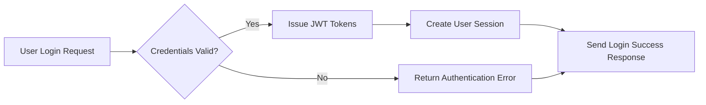
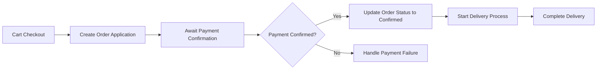

# AI-Based Shopping Mall Backend Requirement Analysis Report

## 1. System Overview

The AI-based shopping mall backend system is a modern, scalable e-commerce platform designed to facilitate multi-channel sales and efficient buyer-seller interactions. It includes advanced features such as personalized AI recommendations, fraud detection, dynamic pricing, and comprehensive product and order lifecycle management.

### 1.1 Business Model

#### Why This Service Exists
There is a market demand for an intelligent, AI-enhanced e-commerce platform providing seamless multi-channel shopping experiences that bridge sellers and buyers effectively, while preserving data integrity and compliance.

#### Revenue Strategy
Revenue is generated through transaction commissions, premium subscriptions for sellers, targeted advertising, and payment processing fees.

#### Growth Plan
Growth will be driven by easy onboarding, multi-channel expansion, personalized engagement powered by AI, and loyalty incentives.

#### Success Metrics
Key performance indicators include monthly active users, transaction volume, average order value, retention rates, and system reliability.

## 2. User Roles and Authentication

### 2.1 User Roles
The system supports the following roles:
- guestUser: Can browse public resources but limited personalized access.
- memberUser: Authenticated shoppers with purchasing and review privileges.
- sellerUser: Members with product management and sales capabilities.
- adminUser: Administrators with full system management rights.

### 2.2 Authentication and Authorization
WHEN a user submits login credentials, THE system SHALL validate credentials within 2 seconds and issue JWT tokens with 30 minutes lifespan and 14 days refresh tokens.

WHEN a user logs in via an external provider, THE system SHALL authenticate and link or create accounts accordingly.

THE system SHALL maintain session security and allow token revocation on logout or suspicious activity.

### 2.3 Permissions Matrix
| Action | guestUser | memberUser | sellerUser | adminUser |
|--------|-----------|------------|------------|-----------|
| Browse products | ✅ | ✅ | ✅ | ✅ |
| Add to cart | ❌ | ✅ | ✅ | ✅ |
| Manage orders | ❌ | ✅ | ✅ | ✅ |
| Post inquiries/reviews | ❌ | ✅ | ✅ | ✅ |
| Manage products | ❌ | ❌ | ✅ | ✅ |
| Configure system | ❌ | ❌ | ❌ | ✅ |

## 3. Product Management

WHEN sellers register or modify products, THE system SHALL capture snapshots preserving all product states over time.

THE system SHALL support complex product options, including dependencies and pricing variations.

Inventory SHALL be managed at the option combination level with automatic out-of-stock handling.

Products SHALL be categorized using hierarchical, channel-specific category systems and spatial sections.

Rich product content, SEO optimization, media support, and tagging are included.

## 4. Cart and Order System

WHEN users add products to carts, THE system SHALL persist selections with option details.

Guest and member carts are managed separately, with session management and expiration policies.

WHEN orders are placed, THE system SHALL validate information, support multi-method payments, partial fulfillment, and track delivery stages.

Payment processing SHALL support asynchronous gateways, cancellations, and confirmations.

## 5. Discount and Payment Systems

Coupons SHALL be issued with configurable discount types, conditions, usage rules including stacking and exclusivity, and validity periods.

Deposit and mileage systems SHALL securely track balances, accrual and usage, with transaction logging and expiry policies.

Administrative mileage donations are supported.

## 6. Product Inquiry and Review System

Customers SHALL submit inquiries and reviews tied to product snapshots.

Seller responses, private posts, comment hierarchies, and moderation tools are supported.

Notification systems keep users informed of new activity.

## 7. Favorites System

Authenticated users MAY mark products, inquiries, and addresses as favorites.

Snapshots corresponding to favorited entities SHALL be preserved to ensure historical integrity.

Favorites can be organized, managed in batches, and users notified of relevant changes.

## 8. System Structure and Scalability

Multi-channel support includes independent category structures and consistent user experience across channels.

Attachment file management supports secure upload, versioning, CDN distribution, and metadata handling.

System scalability is addressed via data denormalization, modular schema design, caching, and sharding.

## 9. Business Rules and Constraints

Snapshots SHALL preserve all critical data changes and support audit and legal requirements.

Order application and payment confirmation processes are separately managed with clear state transitions.

Inventory updates are atomic and option-specific.

Encrypted storage and role-based access control ensure security.

Coupon usage, stacking, refunds, and order cancellation comply with strict business rules.

## 10. Compliance and Legal Requirements

The system SHALL comply with GDPR, CCPA, PCI DSS, AML, and regional e-commerce laws.

Personal data SHALL be encrypted and segregated per channel.

Accessibility standards including WCAG 2.1 and multilingual support are incorporated.

## 11. AI and Advanced Features

AI capabilities include personalized recommendations, fraud detection, dynamic pricing, customer sentiment analysis, and improved search relevance.

Advanced analytics dashboards support real-time sales, segmentation, funnel optimization, and predictive inventory.

Omnichannel features unify customer profiles, order fulfillment, inventory, and loyalty programs.

---

### Mermaid Diagram: User Authentication Flow

### Mermaid Diagram: Order and Payment Processing

This document provides clear, specific, and testable business requirements only. All technical implementation decisions, including system design, API development, and database architecture, are fully at the developer's discretion. The document defines WHAT the system should do, not HOW to build it, ensuring backend developers have a complete and unambiguous foundation for implementation.