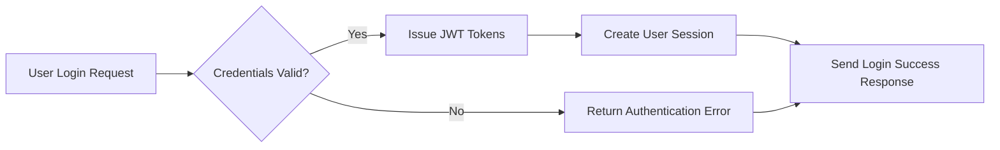
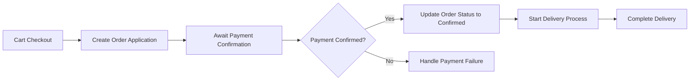
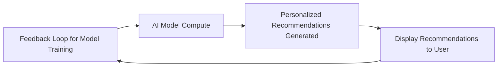

# AI-Based Shopping Mall Backend Requirement Analysis Report

## 1. System Overview

This shopping mall system is designed as a comprehensive, secure, and scalable e-commerce backend platform supporting multiple sales channels and spatial product categorizations called sections. It enables efficient business processes between sellers and buyers including product sales, order management, payment processing, discounts, mileage points, deposits, reviews, and inquiries.

### 1.1 Business Model

#### Why This Service Exists
The platform addresses an essential market gap for modern AI-powered e-commerce platforms that facilitate seamless multi-channel sales, personalized shopping experiences, and robust seller-buyer interactions. It aims to differentiate through AI-driven recommendations, fraud detection, and dynamic pricing.

#### Revenue Strategy
Revenue is generated through seller commissions, premium seller subscriptions, advertising services, and payment transaction fees.

#### Growth Plan
User acquisition focuses on seamless onboarding across channels, omnichannel experience consistency, and personalized incentives.

#### Success Metrics
Key metrics include monthly active users (MAU), transactions, average order value, retention rates, seller growth, and operational uptime.

### 1.2 Core Business Concepts
- **Channel**: Distinct sales conduits such as web or app platforms.
- **Section**: Logical grouping of products similar to store corners.
- **Category**: Multi-level classification unique per channel.
- **Snapshot**: Immutable data capture preserving historical states for auditing and legal compliance.

## 2. User Management

### 2.1 Customer System

#### Requirements
- Users shall access as members, non-members, or external service users.
- Each connection to the shopping mall shall record detailed customer information including IP address, access URL, and referrer.
- Identity verification shall use mobile number and real name checks, supporting international requirements.
- Membership management shall allow registration, multiple emails per account, password security, and account updates or withdrawals.
- External service authentication shall support multiple providers with automatic linkage post-verification.
- Address management shall handle international formats with structured country, region, city, and special instructions.

#### Functional Specifications
1. Customer Management: Create records per connection, track user status, support behavior analytics.
2. Identity Verification: Secure encrypted storage per channel.
3. Membership Management: Secure password policies, account lifecycle management.
4. External Service Integration: Manage external credentials, auto-connect after verification.
5. Address Management: Validation, quick selection, and primary address designation.

### 2.2 Seller and Administrator System

#### Requirements
- Members may elevate to seller or administrator roles.
- Sellers receive product registration and sales privileges.
- Admins receive full system management rights through role-based access control.
- Role separation and permission auditing shall be enforced.

#### Functional Specifications
1. Seller Management: Permissions granting, verification, performance tracking.
2. Administrator Management: Role-based access levels, activity logging, system-wide management functions.

## 3. Product Management

### 3.1 Sales System

#### Requirements
- Sellers shall manage product lifecycle including register, modify, pause, discontinue, with snapshot history.
- Support complex option and inventory management.
- Support channel-specific category systems and product content optimization.

#### Functional Specifications
1. Sales Management: Product lifecycle, bulk operations, status tracking.
2. Snapshot Management: Immutable history upon product changes.
3. Product Composition: Bundled and variant management.
4. Option Management: Various option types, groups, dependencies.
5. Inventory Management: Track by option combination, stock alerts.
6. Category Management: Hierarchical, multi-category assignments.
7. Content Management: Multi-format support, rich media, SEO.
8. Tag and Search Support: Tagging, thumbnails, trending highlighting.

### 3.2 Bulletin Board System

#### Requirements
- Manage product posts encompassing inquiries and reviews.
- Enforce snapshot history on edits.
- Support comments, nested replies, and attachments with moderation.

#### Functional Specifications
1. Post Management: Creation, deletion, moderation.
2. Comment Management: Hierarchical replies, notification system.

## 4. Cart and Order System

### 4.1 Cart System

#### Requirements
- Provide temporary product storage before purchase.
- Support guest and member persistent carts.
- Sellers/administrators may configure cart templates.
- Manage option selections.

#### Functional Specifications
1. Cart Management: Session, expiration, deletion handling.
2. Cart Item Management: Quantity, snapshot linkage, validation.
3. Product Option Management: Inventory metadata, validation, display.

### 4.2 Order System

#### Requirements
- Support cart-to-order conversion.
- Separate order application and payment confirmation.
- Shipment and status management including partial delivery.
- Support after-sales service units.

#### Functional Specifications
1. Order Management: Application processing, payment methods.
2. Order Item Management: Quantity assignment, return/exchange.
3. Order Publishing Management: Payment workflows across gateways.
4. Delivery Management: Multi-product delivery, exception handling.
5. Delivery Stage Management: Stage tracking, notifications.

## 5. Discount and Payment System

### 5.1 Coupon System

#### Requirements
- Issue coupons with configurable discounts and usage rules.
- Track issuance and redemption histories.
- Manage public and private coupon distributions.

#### Functional Specifications
1. Coupon Management: Amount/percentage, usage limits, analytics.
2. Application Condition Management: Section/seller/product filters.
3. Coupon Ticket Management: Validity, redemption workflows.
4. One-time Coupons: Secure generation, expiration.

### 5.2 Deposit/Mileage System

#### Requirements
- Deposit charging and usage support.
- Mileage accrual, usage, expiration tracking.
- Transaction history and fraud prevention.

#### Functional Specifications
1. Deposit Management: Metadata, history, validation.
2. Charging Management: Payment processing, cancellations.
3. Mileage Management: Balances, expiration policies.
4. Mileage Donation Management: Admin functions, reporting.

## 6. Product Inquiry and Review System

### 6.1 Inquiry System

#### Requirements
- Manage product inquiries and reviews with private post options.
- Seller responses and notification support.
- Rating and review analytics.

#### Functional Specifications
1. Inquiry Management: Snapshot linkage, categorization.
2. Review Management: Verified purchase, moderation.
3. Response Management: Official responses, metrics.
4. Comment Management: Seller/customer distinction, privacy.

## 7. Favorites System

#### Requirements
- Support favorites for products, inquiries, and addresses.
- Snapshot storage at time of favoriting.
- Personalized favorites organization.

#### Functional Specifications
1. Product Favorites: Snapshot preservation, notifications.
2. Inquiry Favorites: Updates notification, bookmarks.
3. Address Favorites: Primary address, validation, quick selection.

## 8. System Structure and Scalability

### 8.1 Channel and Section System

#### Requirements
- Support multi-channel management with distinct categories.
- Maintain consistent user experience across channels.

#### Functional Specifications
1. Channel Management: Registration, configuration, analytics.
2. Category Management: Hierarchical structures, mapping.
3. Section Management: Visibility, merchandising.

### 8.2 Attachment File System

#### Requirements
- Support file attachments with metadata and secure access.

#### Functional Specifications
1. File Management: Upload, versioning, CDN integration.

## 9. Business Rules and Constraints

### 9.1 Data Integrity and Evidence Preservation
- Record all significant data changes as snapshots.
- Use logical deletion with timestamps.
- Preserve audit trails for compliance.

### 9.2 Security and Permissions
- Encrypted storage of personal data.
- Role-based access control and audit logging.

### 9.3 Business Logic
- Coupon exclusivity and stacking rules.
- Order refund and exchange policies.

## 10. System Scalability and Future Plans

### 10.1 Extensible Structure
- Support additional channels and payment methods.
- Expand external integrations.

### 10.2 Performance Optimization
- Denormalization, caching, read/write separation.

### 10.3 Advanced Features
- AI-driven recommendations, fraud detection.
- Advanced analytics and omnichannel capabilities.

## 11. Compliance and Legal Requirements

### 11.1 Regulatory Compliance
- GDPR, CCPA, PCI DSS compliance.
- Tax and e-commerce legal adherence.

### 11.2 Accessibility and Inclusivity
- WCAG 2.1 standards.
- Multilingual and culturally sensitive support.

---

### Mermaid Diagram: User Authentication Flow

### Mermaid Diagram: Order and Payment Processing

### Mermaid Diagram: AI Recommendation Process

This document defines executable business requirements for backend developers. It focuses exclusively on WHAT the system must do, leaving all HOW (architecture, API implementation, and database design) to developer discretion. This ensures clarity, completeness, and precision for immediate system development.