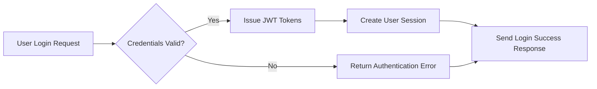
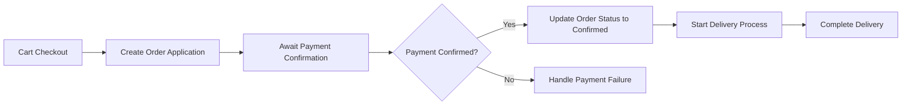
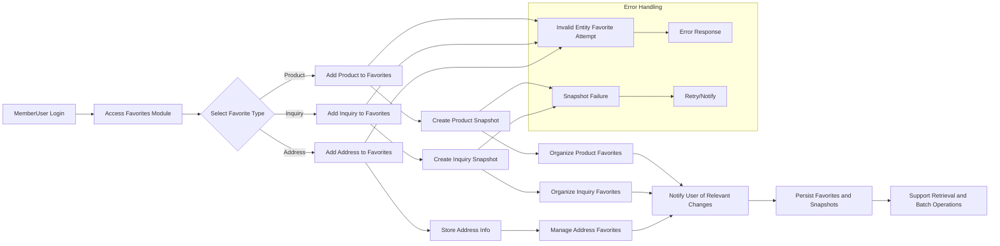
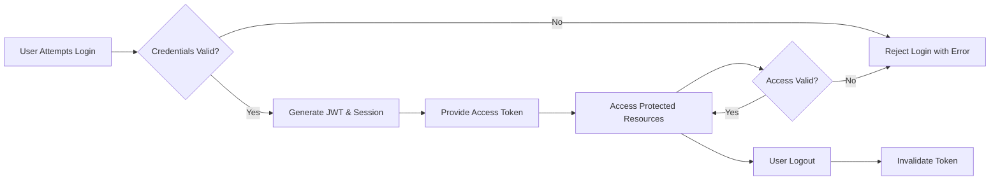
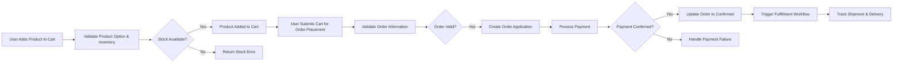
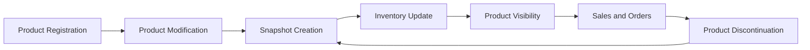
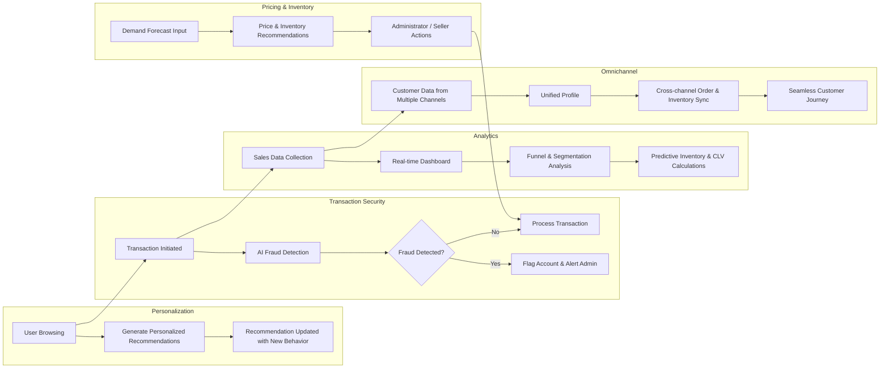

# Shopping Mall AI-Based Backend Requirement Analysis Report

## 1. System Overview

This shopping mall backend system is a modern, AI-integrated e-commerce platform designed to facilitate secure and efficient transactions among multiple sellers and buyers across diverse sales channels and spatial product sections. It offers comprehensive features including product sales, order management, payment processing, discount and reward systems, user-generated content management, favorites personalization, scalable system architecture, and regulatory compliance.

### 1.1 Business Model

#### Why the Business Exists
There is a market need for an intelligent e-commerce backend capable of multi-channel and multi-role support, integrating AI technologies such as personalized recommendations, dynamic pricing, and fraud detection. This platform addresses gaps in current systems by offering rich product configurability and seamless seller-customer interaction.

#### Revenue Model
Revenue derives from transaction commissions, premium seller subscriptions, targeted promotions via coupons and loyalty programs, and payment processing fees.

#### Growth Strategy
Growth focuses on user acquisition through external service integration, omnichannel consistency, personalized recommendations, and expansion of payment methods.

#### Core Value Proposition
The system provides a unified backend for multiple channels with scalable product and order management, AI-driven personalization, robust security, and compliance with global legal standards.

#### Success Metrics
Key performance indicators include transaction volume, active user counts, average order values, retention rates, and seller performance analytics.

## 2. User Roles and Authentication System

### 2.1 User Role Definitions
- guestUser: Unauthenticated users with browsing and registration capabilities.
- memberUser: Registered customers with purchase, review, and rewards functionality.
- sellerUser: Members with product and sales management permissions.
- adminUser: Administrators with system-wide management and audit access.

### 2.2 Authentication Flow
WHEN users submit credentials, THE system SHALL validate and issue JWT tokens within 2 seconds.
Tokens SHALL expire in 30 minutes (access) and 14 days (refresh).

### 2.3 Permissions
Detailed RBAC policies define feature access per role, ensuring secure and appropriate usage.

## 3. Product Management

Features cover product lifecycle states, snapshot-based history, complex option and inventory management, category hierarchies, and bulletin board integration for inquiries and reviews.

## 4. Cart and Order System

Supporting guest and member carts, order application and confirmation separation, multiple payment methods, partial and split shipments, and delivery stage tracking.

## 5. Discount and Reward Systems

Coupon issuance and application with strict usage rules, deposit and mileage management, transaction histories, and anti-fraud validation.

## 6. Customer Interaction Systems

Management of product inquiries, reviews with verified purchase badges, seller responses, commenting, and private posting capabilities.

## 7. Favorites Management

Favorites for products, inquiries, and addresses including snapshot preservation, personalized organization, batch operations, and notifications.

## 8. System Structure and Scalability

Multi-channel support, product sections, channel-specific categories, file attachment management with metadata and CDN integration, and optimized data structures.

## 9. Business Rules and Constraints

Snapshot-based data integrity, order-payment lifecycle rules, inventory update policies, encryption of sensitive data, role-based permissions, and discount stacking limitations.

## 10. Compliance and Legal Requirements

Data privacy laws compliance (GDPR, CCPA), PCI DSS payment security, AML/KYC controls, web accessibility (WCAG 2.1), multilingual support, and legal audit trails.

## 11. AI and Advanced Features

Personalized recommendations, fraud detection, dynamic pricing, customer sentiment analysis, real-time analytics dashboards, customer segmentation, and omnichannel experiences.

# Mermaid Diagrams

