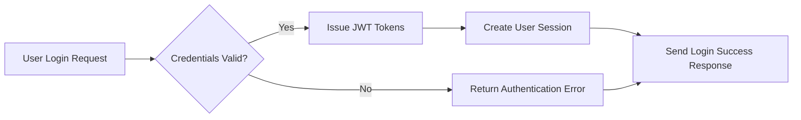
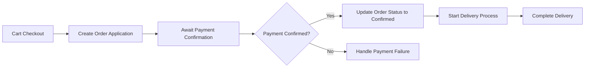

# AI-Based Shopping Mall Backend Requirement Analysis Report

## 1. System Overview

The AI-powered shopping mall backend is designed as a scalable, secure e-commerce platform supporting multiple sales channels. It enables seamless buyer-seller interactions, facilitating product listings, order management, payment processing, and AI-enhanced personalization.

### 1.1 Business Model

This platform addresses market needs for intelligent e-commerce backends that differentiate through multi-channel support, personalized experiences, and fraud protection. Revenue streams include transaction commissions, seller subscriptions, and promotion fees. Growth relies on seamless onboarding, omnichannel presence, and AI-driven retention programs.

## 2. User Roles and Authentication

Four roles are defined:
- guestUser: Public visitor with browsing rights only.
- memberUser: Registered shoppers who can purchase, review, and engage.
- sellerUser: Members allowed product management and sales tracking.
- adminUser: Full access administrators.

Authentication uses JWT tokens expiring in 30 minutes with 14-day refresh capability. External identity providers are supported with encrypted data storage per channel.

## 3. Product Management

Sellers manage products with lifecycle states (active, paused, discontinued). Snapshots are taken on create and modify actions for audit. Product options affect pricing and inventory at a granular level. Categories and sections follow hierarchical, channel-specific structures.

Rich media and SEO optimization are included for product content.

## 4. Cart and Order System

Carts are persistent per customer session. Orders convert from carts with comprehensive payment methods (mixed, asynchronous) and support for partial shipment and delivery stages.

## 5. Discount and Payment System

Coupons have configurable discounts, usage rules, validity periods, and issuance controls. Deposits and mileage systems include secure charging, usage tracking, expiration, and donation functionalities.

## 6. Inquiry and Review System

Product inquiries and reviews link to snapshots. Sellers respond officially. Private posts and hierarchical comments with moderation tools enable effective customer communication.

## 7. Favorites System

Users can favorite products, inquiries, and addresses, with snapshots capturing state at favoriting. Personal organization and notifications enhance engagement.

## 8. System Structure and Scalability

Supports multiple channels and sections with unique category taxonomies. Attachment files are securely stored, versioned, and delivered via CDN. Data denormalization and schema extensibility enhance performance.

## 9. Business Rules and Constraints

Data integrity is enforced with snapshot histories and soft deletions. Order-payment lifecycles follow strict state transitions. Inventory management is granular and atomic. Encryption and RBAC ensure security.

## 10. Compliance and Legal Requirements

The system complies with GDPR, PCI, AML, KYC, accessibility standards, and supports multilingual localization.

## 11. AI and Advanced Features

AI functionalities include personalized recommendations, fraud detection, dynamic pricing, sentiment analysis, analytics dashboards, and unified omnichannel customer experiences.

---

### Mermaid Diagrams

This document provides business requirements only. All technical implementation decisions, including architecture, APIs, and database design, are fully delegated to the development team. The document specifies WHAT the system must do, not HOW to build it.